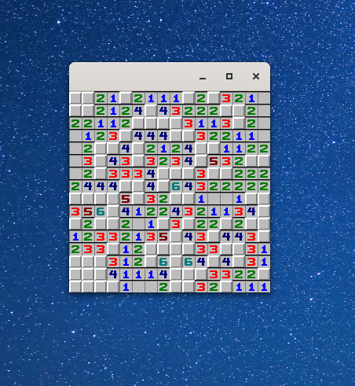

# Minesweeper using no external libraries

A video game only using direct X11 calls for rendering, without any library, in Odin.

https://gaultier.github.io/blog/write_a_video_game_from_scratch_like_1987.html

`odin build src -o:speed`

https://github.com/gaultier/minesweeper-from-scratch/raw/master/screencast.webm

